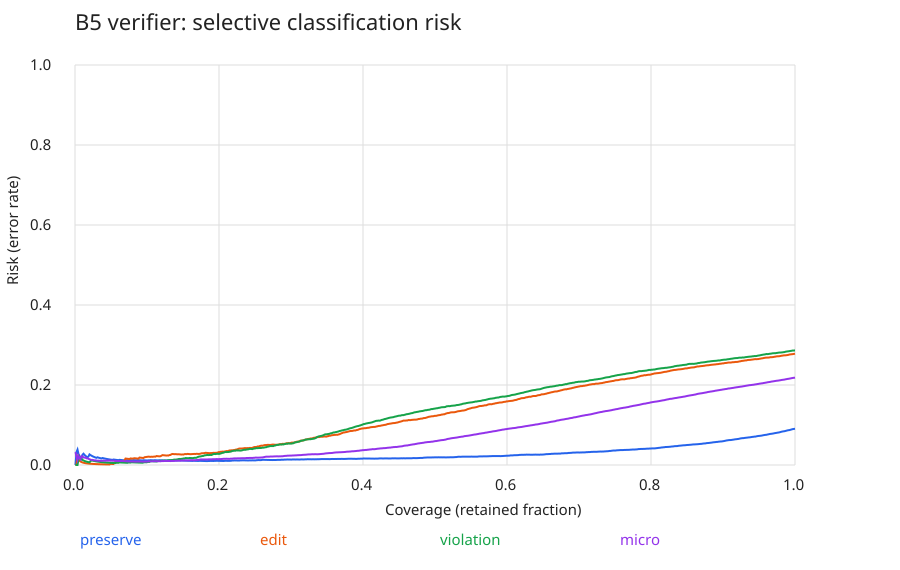

# B5 FINAL AUDIT

**Ngày:** 23/09/2026 · **Run:** `B5_override_20260922-085644`

Đã tổng hợp prediction của **5.000 samples**, tính Verifier Precision/Recall/F1/AUROC, confusion matrix và Risk–Coverage từ xác suất đã lưu. Giữ nguyên model, dataset và training protocol; không train hoặc chạy inference mới.

## 1. Checkpoint

- File: `runs/B5_override_20260922-085644/best_checkpoint.pt`.
- Backbone: CLIP `ViT-L-14-quickgelu`, pretrained `openai`, đóng băng theo thiết kế.
- Checkpoint ở bước **12.605**; training hoàn tất **14.060** bước.
- Theo mã hiện có, checkpoint “best” được chọn theo **training batch loss nhỏ nhất**, không theo validation metric.

## 2. Seed

Training B1/B4/B5 và mining đều dùng **seed 0**. Chưa xác minh seed chia split. Lượt export dùng toàn bộ prediction, không lấy mẫu ngẫu nhiên.

## 3. Git commit

Cả ba run ghi **`unknown`** trong `git_commit.txt`; chưa xác định được commit lịch sử vì mã nguồn được chuyển bằng ZIP.

## 4. Dataset + split

- Dữ liệu: pseudo-edit tuples từ ảnh/caption CC3M.
- Train manifest: `/home/iec/datasets/cc3m/pseudo_screening/train.csv` — **45.000 samples** theo run protocol.
- Evaluation: **5.000 records** trong `constraint_scores.json`. Chưa có đường dẫn/hash manifest đánh giá để xác minh split.
- Mỗi sample gồm reference, modification và **3 candidates: positive, CF-A, CF-B**. Vì vậy, 5.000 samples tạo ra **15.000 candidate predictions**, không phải 15.000 samples mới.

## 5. Nguồn gốc 45.000 samples

Mining config ghi nguồn `subset_5000/cc3m_captioned.csv`, quét **100.000 records** và tạo **50.000 tuples** bằng quy tắc đối tượng/thuộc tính trong caption. B5 tái sử dụng bộ train **45.000 tuples** của B4.

Số lượng train/evaluation phù hợp tỷ lệ 90/10, nhưng **chưa xác minh được quy tắc chia 50.000 tuples**. Đây là nhãn giả từ caption; số records/tuples không đồng nghĩa số ảnh độc lập.

## 6. Risk definition

**Risk = số dự đoán verifier sai / số dự đoán được giữ lại.**

Nhãn dự đoán bằng 1 khi `p >= 0.5`, ngược lại bằng 0. Risk ở đây là lỗi phân loại verifier, không phải lỗi retrieval trên toàn bộ gallery.

## 7. Confidence definition

**Confidence = `max(p, 1 − p)`**, tính riêng cho mỗi đầu ra verifier. Confidence cao thể hiện sự chắc chắn về nhãn dự đoán, không đồng nghĩa candidate phù hợp hơn.

## 8. Risk–Coverage protocol

- Dùng đầy đủ 5.000 samples; sắp xếp các quyết định theo confidence giảm dần.
- Quét từng ngưỡng confidence; các quyết định bằng confidence được giữ cùng nhau.
- **Coverage = số quyết định giữ lại / tổng số quyết định**. Không tính risk tại coverage 0.
- Tính riêng Preserve/Edit/Violation: **15.000 quyết định mỗi đầu ra**; micro: **45.000 quyết định**.
- Không hiệu chuẩn xác suất, không tối ưu threshold. Risk tại coverage 100% bằng `1 − accuracy`.

Nếu trình xem Markdown không hiển thị ảnh SVG, mở trực tiếp [biểu đồ](risk_coverage.svg) bằng trình duyệt. [Dữ liệu đầy đủ](risk_coverage.csv).

## 9. Verifier metrics

Ngưỡng phân loại **0.5**. Nhãn `(Preserve, Edit, Violation)`: positive `(1,1,0)`, CF-A `(1,0,1)`, CF-B `(0,1,1)`.

| Đầu ra | Precision | Recall | F1 | AUROC |
|---|---:|---:|---:|---:|
| Preserve | 0.916755 | 0.950400 | 0.933274 | 0.956352 |
| Edit | 0.763859 | 0.843300 | 0.801616 | 0.791563 |
| Violation | 0.731312 | 0.902000 | 0.807737 | 0.781804 |
| Micro | 0.798939 | 0.898567 | 0.845829 | 0.863286 |

Micro gộp ba đầu ra. AUROC dùng xác suất liên tục, xử lý score bằng nhau bằng nửa điểm. **Micro accuracy = 78,1622%**, khớp kết quả gốc và console export trên server.

## 10. Confusion matrix

Quy ước ma trận: `[[TN, FP], [FN, TP]]`; hàng là nhãn thật, cột là nhãn dự đoán, thứ tự 0/1. Nhãn thật ở đây là nhãn giả theo loại candidate.

| Đầu ra | TN | FP | FN | TP | Tổng |
|---|---:|---:|---:|---:|---:|
| Preserve | 4.137 | 863 | 496 | 9.504 | 15.000 |
| Edit | 2.393 | 2.607 | 1.567 | 8.433 | 15.000 |
| Violation | 1.686 | 3.314 | 980 | 9.020 | 15.000 |
| Micro | 8.216 | 6.784 | 3.043 | 26.957 | 45.000 |

Tất cả đều từ **5.000 samples**. Tổng micro 45.000 là số quyết định nhị phân, khác với 45.000 samples train. [File CSV](confusion_matrix.csv).

## 11. Evaluation protocol của B1/B4/B5

Cả ba run ghi seed 0, 5 epochs, batch 16 và cùng đường dẫn train manifest. B1 dùng retrieval + factorization; B4 thêm counterfactual loss; B5 thêm verifier loss.

Evaluator chạy eval mode, không gradient, không shuffle và không bỏ batch cuối. Positive phải có similarity **lớn hơn** CF-A/CF-B để tính thắng; hard-negative error bằng `1 − both-win`.

| Model | Samples | CF-A win (%) | CF-B win (%) | Both win (%) | Hard-negative error (%) |
|---|---:|---:|---:|---:|---:|
| B1 | 5.000 | 80.04 | 95.78 | 77.54 | 22.46 |
| B4 | 5.000 | 77.98 | 97.68 | 76.58 | 23.42 |
| B5 | 5.000 | 78.06 | 97.82 | 76.84 | 23.16 |

Đây là điểm **Stage-1 trước rerank**, không đo lợi ích reranking B5 hay Recall@K trên CIRR/Fashion-IQ. Ba file có cùng thứ tự modification/attribute type; thiếu ID ảnh nên chưa chứng minh các tuple ảnh hoàn toàn giống nhau.

## 12. Các deviation/issue

- **GO gate chưa đạt:** B4 chưa cải thiện so với B1; B5 chạy exploratory với `manual_go_override=true`, khởi tạo mới, không warm-start B4.
- **Chất lượng dữ liệu:** run protocol ghi nhận label noise và train/validation image overlap chưa khắc phục. 93,2% mẫu đánh giá thuộc nhóm color.
- **Thiếu truy vết:** chưa có Git commit, danh tính manifest đánh giá, ID ảnh và checkpoint hash tại lúc inference. Hash artifact hiện tại không chứng minh đầy đủ liên kết lịch sử.
- **Phạm vi prediction:** file `per_query_predictions.json` cũ là placeholder `[]`; dữ liệu thực được export từ `constraint_scores.json`, không phải prediction full-gallery.
- **Giới hạn thống kê:** một seed; các candidate/đầu ra trong cùng sample không độc lập. Risk–Coverage chưa có calibration, AURC hoặc query-level retrieval risk.

**Bằng chứng:** gói `PE-CIR-training-results.zip`, config/run protocol/mining config, scores và metrics đã lưu, kết quả export và console server. Các bảng đã được đối chiếu; thông tin chưa xác minh được giữ rõ như trên. Hash và diễn giải chi tiết nằm trong [bản audit đầy đủ](B5_FINAL_AUDIT_DETAILED.md).
